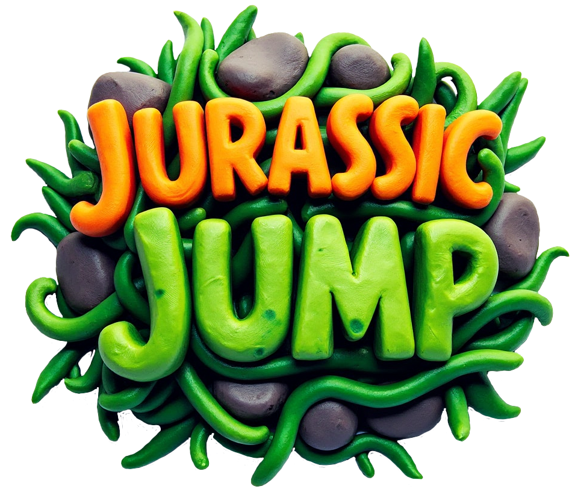

# Jurassic Jump

<p align="center">
  <a href="https://avollrath.github.io/jurassic-jump/"><strong>Play the live version</strong></a>
</p>

<p align="center">
  <video src="./preview.mp4" controls muted playsinline width="100%"></video>
</p>

<p align="center">
  <strong>A colorful dinosaur platformer built with Godot.</strong>
</p>

<p align="center">
  Jump across prehistoric levels, bounce on mushrooms, dodge enemies, collect coins, and race to the finish.
</p>

<p align="center">
  
</p>

## Overview

Jurassic Jump is a 2D platformer with a playful prehistoric theme, multiple handcrafted levels, collectible coins, moving enemies, bounce mechanics, particle effects, music, and a browser export for easy sharing.

The project is built in Godot and includes a custom branded web shell, scene-based level flow, and lightweight resource preloading for a smoother startup experience.

## Features

- Three themed platforming levels with level-to-level progression
- Coin collection and score tracking
- Player health and game over flow
- Enemy encounters with stomp and damage interactions
- Bounce mushrooms and finish portals
- Custom particles, audio feedback, and animated environments
- Web export inside the `docs/` folder for GitHub Pages deployment
- Custom HTML shell for preserving branded web loading visuals across exports

## Gameplay

- Move through each level and reach the goal to advance
- Collect coins to increase your score
- Avoid or stomp enemies depending on the enemy type
- Use mushrooms for stronger jumps
- Survive all levels to reach the final screen

## Controls

- `A` or `Left Arrow`: Move left
- `D` or `Right Arrow`: Move right
- `Space` or `W`: Jump
- `Esc`: Exit / back where supported

## Play Online

If you publish the contents of `docs/` with GitHub Pages, the game can be played directly in the browser.

Suggested flow:

1. Export the Web build to `docs/`
2. Push the repository to GitHub
3. Enable GitHub Pages for the repository
4. Point Pages to the branch and `/docs` directory

## Run Locally

### Godot

1. Open the project in Godot
2. Load `project.godot`
3. Press Play

### Web Build

1. Export the Web preset
2. Serve the `docs/` folder with a local web server
3. Open the generated site in a browser

## Tech Stack

- Godot 4
- GDScript
- Web export via Godot HTML5/Web target
- Custom HTML shell for browser branding

## Project Structure

```text
assets/    Art, sprites, particles, music, and sound effects
docs/      Exported web build
scenes/    Main scenes, levels, UI, and gameplay prefabs
scripts/   Gameplay logic and managers
web/       Custom web export shell
```

## Notes

- The web build is configured to export into `docs/`
- A custom shell at `web/custom_shell.html` preserves the branded loader on future exports
- The repository is set up so browser deployment is straightforward

## Credits

Created by André Vollrath.

## License

Add your preferred license here.
